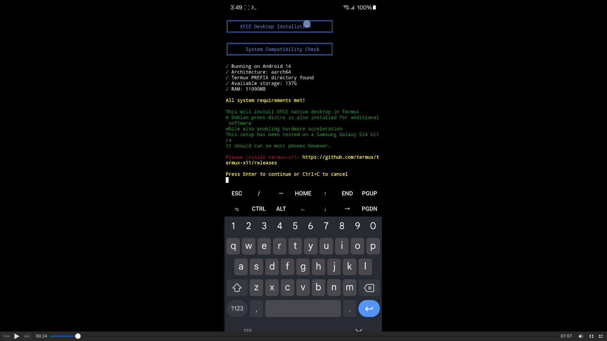

# Termux XFCE Desktop Setup

This repository provides a script to set up an XFCE desktop environment and a Debian proot installation within Termux. The setup utilizes the Termux-X11 server, which will be installed during the process. You will be prompted to allow Termux to install the corresponding Android APK.

## Key Features
- **User-Friendly Setup**: Simply choose your username and follow the on-screen prompts.
- **Storage Requirements**: Approximately 4GB of storage space is required. Note that additional applications will consume more space.
- **Detailed Documentation**: Please review the full README for comprehensive information about this setup.

## Installation

To install, execute the following command in Termux:

```bash
curl -sL https://raw.githubusercontent.com/phoenixbyrd/Termux_XFCE/main/install_xfce_native.sh -o install.sh && bash install.sh
```

## Support and Community

For questions, assistance, or suggestions, join our Discord community:  
[Discord Invite Link](https://discord.gg/pNMVrZu5dm)

## Screenshots



## Use Case

This setup is optimized for use on devices like the Samsung Galaxy Fold 3, functioning as a PC/laptop replacement when connected to a monitor, keyboard, and mouse. It is designed for daily use and serves as a personal daily driver.


## Starting the Desktop

To start the desktop, use the following command:

```bash
start
```

This command initiates a Termux-X11 session, starts the XFCE4 desktop, and opens the Termux-X11 app directly into the desktop.

To access the Debian proot environment from the terminal, use:

```bash
debian
```

Note: The display is pre-configured in the Debian proot environment, allowing you to launch GUI applications directly from the terminal.

## Hardware Acceleration & Proot

Several aliases are provided to simplify launching applications:

### Termux XFCE:
- `prun`: Execute commands from the Debian proot environment directly in the Termux terminal without entering the proot shell.
- `zrun`: Launch applications in Debian proot with hardware acceleration.
- `zrunhud`: Launch applications with hardware acceleration and FPS HUD.

### Debian Proot:
`debian` To enter the Debian proot environment, from there, you can install additional software using `sudo apt`.

## Additional Utilities

- `cp2menu`: Copy `.desktop` files from Debian proot to the Termux XFCE menu for easy access.
- `app-installer`: Easy to use GUI app to manage installing additional apps not available in Termux or Debian repositories.

## Troubleshooting

### Process Completed (Signal 9) - Press Enter

1. Install LADB from the Play Store or download it from [here](https://github.com/hyperio546/ladb-builds/releases).
2. Connect to Wi-Fi.
3. Enable wireless debugging in Developer Settings and note the port number and pairing code.
4. Enter these values in LADB.
5. Once connected, run the following command:

```bash
adb shell "/system/bin/device_config put activity_manager max_phantom_processes 2147483647"
```

You can also run `adb shell` directly from Termux by following the guide in this video:  
[YouTube Guide](https://www.youtube.com/watch?v=BHc7uvX34bM)
